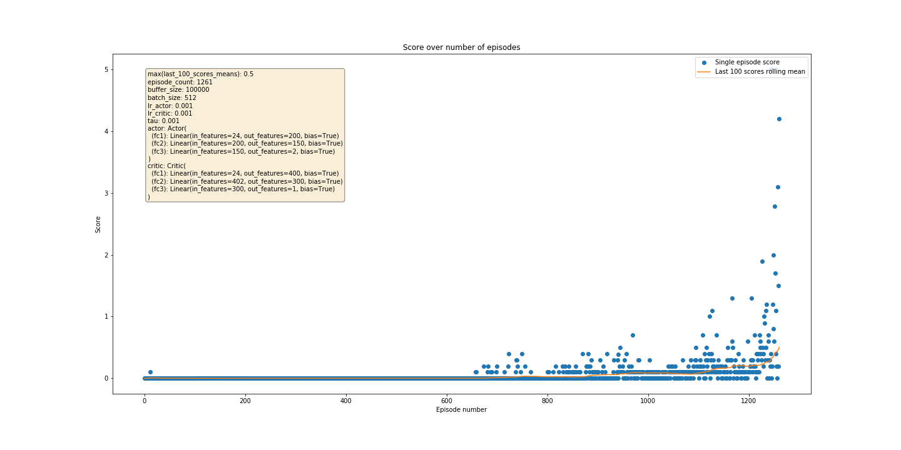

# Collaboration and Competition with MADDPG

## Learning algorithm

In this project I applied the MADDPG algorithm to control two rackets held by two tennis player agents aiming at bouncing a ball over a net.

a double-jointed arm so that the agent's hand is in the goal location for as many time steps as possible in the Reacher Unity Environment. My understanding of this algorithm comes from DeepMind's paper ["Multi-Agent Actor-Critic for Mixed
Cooperative-Competitive Environments"](https://arxiv.org/pdf/1706.02275.pdf), written by authors Ryan Lowe, Yi Wu and others, and from Alexis Cook's application in Udacity's Deep Reinforcement Learning [repo](https://github.com/udacity/deep-reinforcement-learning/tree/master/ddpg-bipedal)

### Hyperparameters
The MADDPG agent's hyperparameters were the following:
```
BUFFER_SIZE = 100000  # replay buffer size
BATCH_SIZE = 512      # minibatch size
GAMMA = 0.99          # discount factor
TAU = 0.001           # soft update rate of target parameters
ACTOR_LR = 0.001      # actor learning rate 
CRITIC_LR = 0.001     # critic learning rate 
UPDATE_EVERY = 2      # how often to update the network
```

### Actor and Critic model architecture
I used a relatively simple neural network with 2 fully-connected hidden layers and 1 output layer.

The critic network has:

- 400 units in the first hidden layer
- 300 units in the second hidden layer
- ReLU activation in both hidden layers
- 1 output unit for the value of the `(state, action)` pair
- no activation in the output layer

The actor network has:

- 200 units in the first hidden layer
- 150 units in the second hidden layer
- ReLU activation in both hidden layers
- 4 output units, one for each joint
- tanh activation in the output layer

### Plot of Rewards


### Ideas for future work
Next ideas to explore to decrease the number of episodes needed to solve the environment:
- Different values of discount rate, learning rate, soft-update rate, batch size and buffer size
- Different number of layers, units per layer and activation function
- Prioritized experienced replay